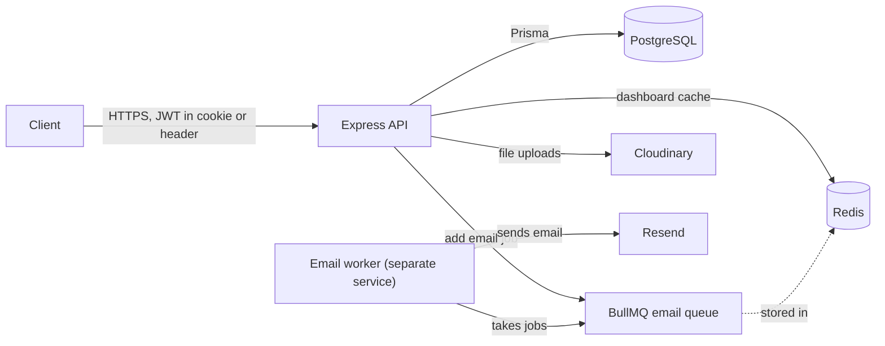
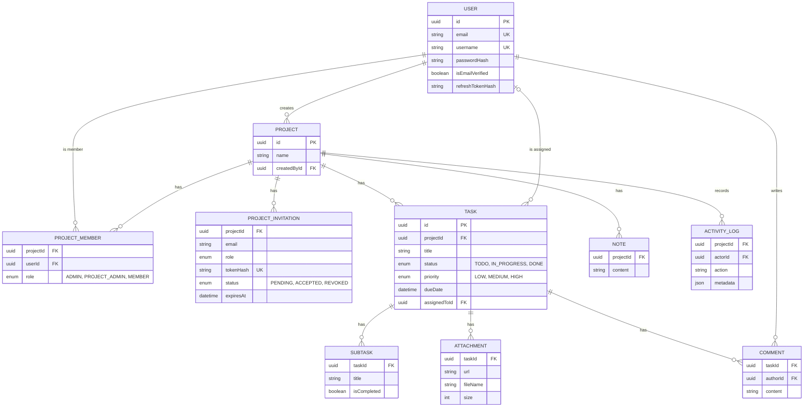

# Plane | Production-Grade Project Management System with RBAC, Redis Caching, and Background Job Processing

Plane is a REST API where teams organize work into projects, with tasks, comments, notes and invitations controlled by per-project roles.

**Live API docs:** https://api.plane.yashlalwani.info/api-docs

## Tech stack

- **Runtime and language:** Node.js 24, TypeScript
- **Framework and validation:** Express 5, Zod
- **Database and storage:** PostgreSQL, Prisma ORM, Cloudinary (file uploads via Multer)
- **Caching and jobs:** Redis (ioredis), BullMQ, Resend (email)
- **Auth and security:** JWT (jsonwebtoken), bcrypt, Helmet, CORS, express-rate-limit
- **Testing and tooling:** Vitest, Supertest, ESLint, Prettier, Pino, OpenAPI with Swagger UI
- **Deployment:** Docker, Docker Compose, GitHub Actions CI, Railway

## Architecture



Every request goes through validation (Zod), authentication (JWT) and a role check before the controller reads or writes PostgreSQL through Prisma. The project dashboard is served from Redis when it is cached. Emails are not sent during the request: the API adds a job to a BullMQ queue, and a separate worker process picks it up and sends it through Resend.

## Database schema



## Key features

- Register, log in, verify email, and reset or change a password, with short-lived access tokens and rotating refresh tokens.
- Per-project roles (Admin, Project Admin, Member) checked on every project route; the last Admin can't be removed or demoted.
- Email invitations with 7-day links; only a verified user with the invited email can accept.
- Tasks with status, priority, due date and assignee, plus search, filters, sorting and pagination.
- Subtasks, comments, project notes and file attachments stored on Cloudinary.
- Activity log that records important project changes as a paginated feed.
- Project dashboard with task counts by status and priority, overdue tasks and open work per member, cached in Redis.
- Rate limiting on auth routes, a health check for the database and Redis, and integration tests that run in CI on every push.

## Design decisions

- **Redis cache for the dashboard:** the dashboard runs several count and group-by queries, so the result is cached for 60 seconds. It is deleted whenever tasks or members change, so it never shows old data, and if Redis is down the API computes it from the database instead of failing.
- **BullMQ worker for emails:** sending email is slow and can fail, so the API only adds a job and responds right away. A separate worker sends the email and retries 3 times with exponential backoff, so a short Resend outage doesn't lose emails or slow down requests.
- **RBAC per project:** the role is stored on the project membership, so the same user can be an Admin in one project and a Member in another. One middleware checks the membership and role, and non-members get 404 so they can't learn which projects exist.
- **JWT access and refresh tokens in httpOnly cookies:** JavaScript can't read httpOnly cookies, which protects the tokens from XSS. The access token lasts 15 minutes, and the refresh token (7 days) is stored only as a hash and replaced on every refresh, so an old token stops working once it is used.

## Running locally

```bash
git clone https://github.com/Yash-Lalwani/Plane.git && cd Plane
cp backend/.env.example backend/.env
docker compose up -d postgres redis
cd backend && npm install && npm test
```
